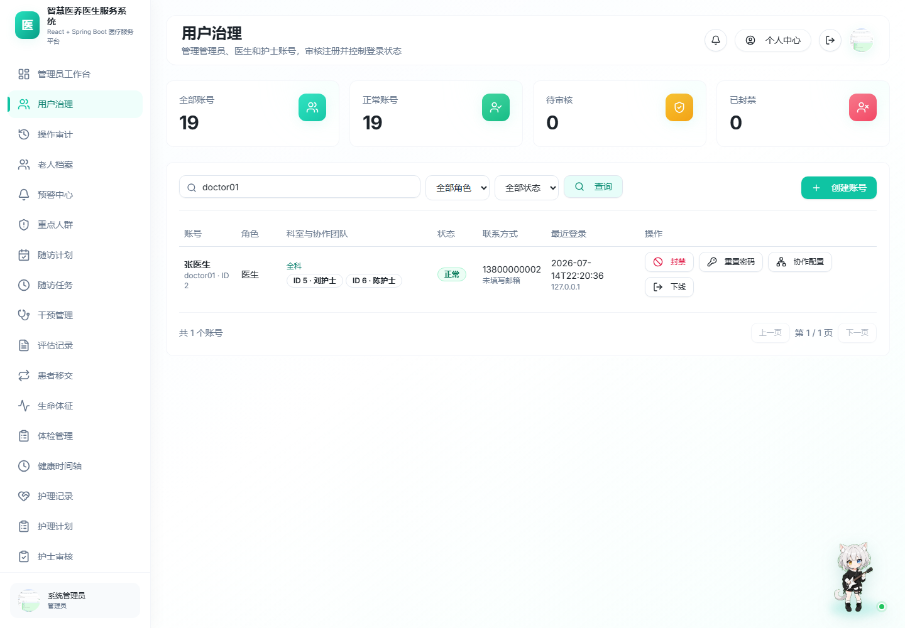
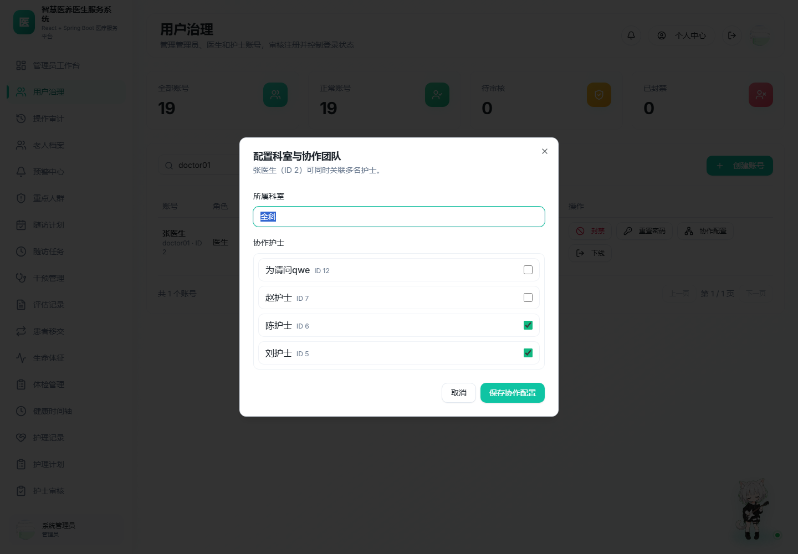
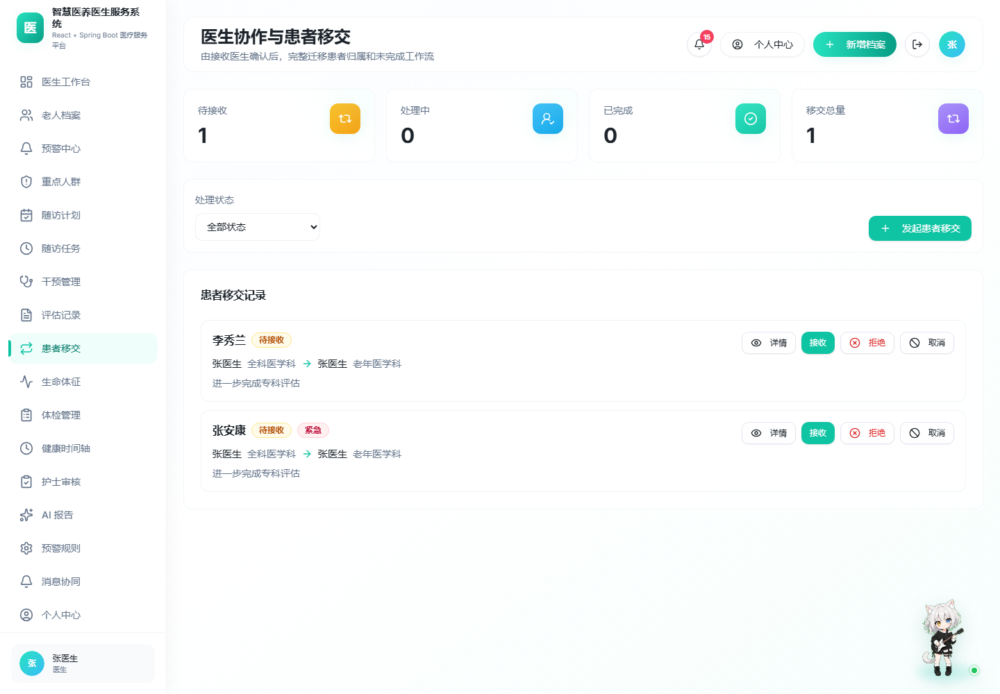
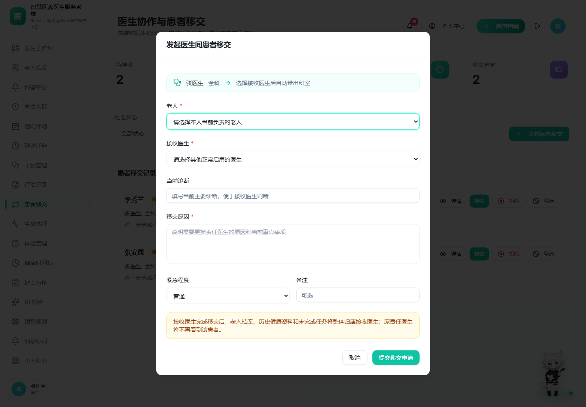
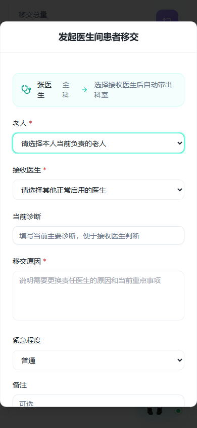

# 医生护士协作关系与患者移交验证

## 管理员协作关系

- 管理员用户治理列表直接展示医生科室，以及对应护士的用户 ID 和姓名。
- `doctor01`（张医生，用户 ID 2）当前关联 `nurse01`（刘护士，用户 ID 5）和 `nurse02`（陈护士，用户 ID 6）。
- 协作配置弹窗支持医生关联多名护士、护士关联多名医生，并允许维护医生科室。

## 医生间患者移交

- 发起医生只能从自己当前负责的老人中选择患者。
- 接收医生来自正常启用的真实医生账号，选项直接显示医生 ID、姓名和科室。
- 接收医生完成移交时，系统在同一事务内迁移未完成预警、随访计划、随访任务、干预、护理计划、护理记录和草稿报告，最后切换老人责任医生与责任护士。
- 历史作者和历史操作记录不被覆盖；旧责任医生通过患者数据权限立即失去该老人及相关记录的访问权限。

## 自动化与真实数据库验证

- 后端测试：205 项通过，0 失败。
- 前端：TypeScript 与 Vite 正式构建通过；Oxlint 仅保留 2 条原有 Fast Refresh 警告。
- Playwright：桌面端和 390×844 移动端均无水平溢出；浏览器控制台无错误。
- 本地数据库迁移前已备份，迁移前后有效老人档案均为 19 条，没有清空或减少原有数据。
- 真实 API 临时数据验证：老人 ID 25 从医生 ID 2 移交到医生 ID 3；随访计划和随访任务责任医生同步变为 3；新责任护士为医生 3 协作团队内的护士 ID 6；旧医生列表中该老人数量为 0；验证完成后仅清理该临时测试老人，档案总数恢复为 19。
