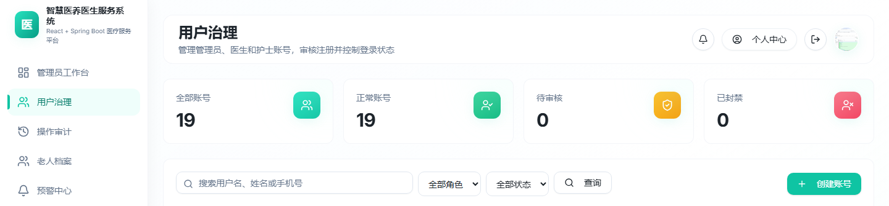
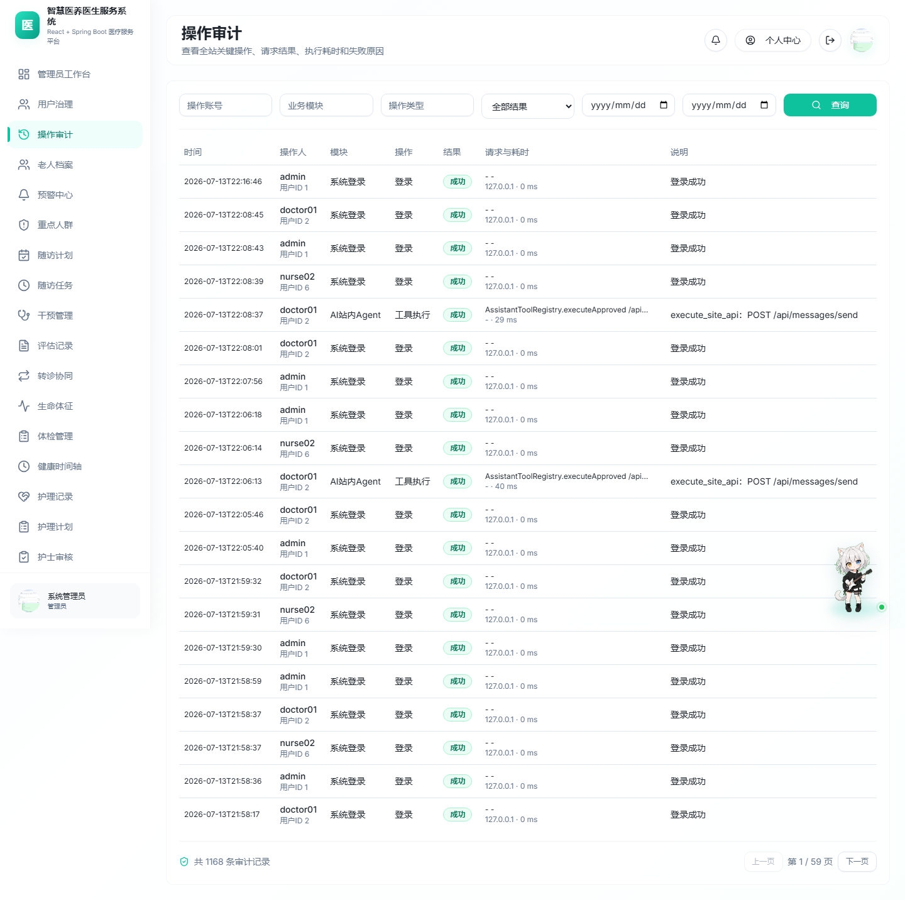
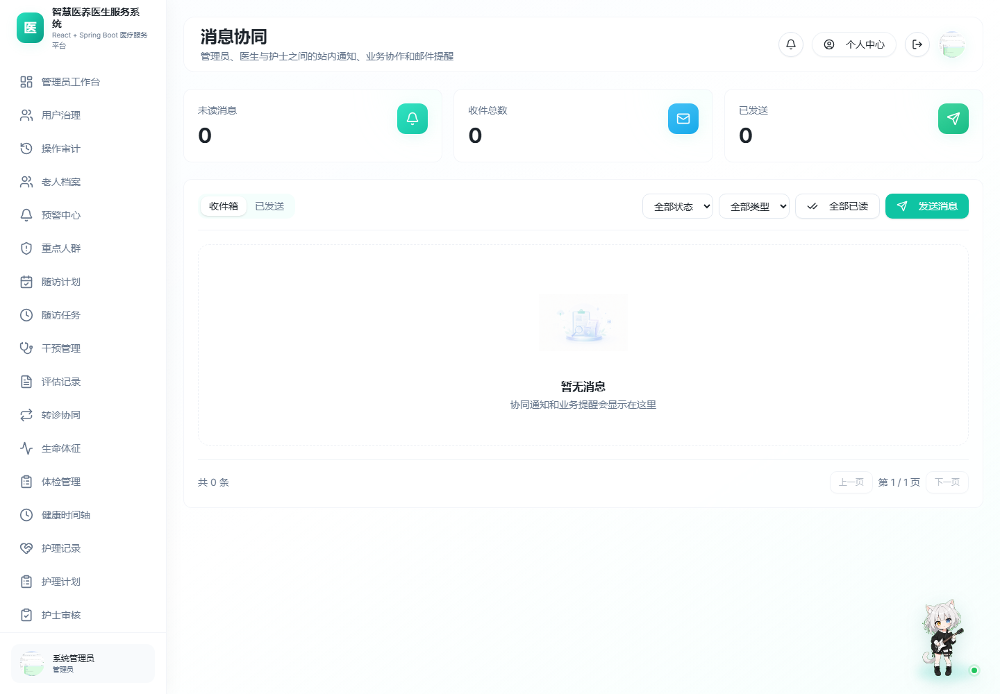
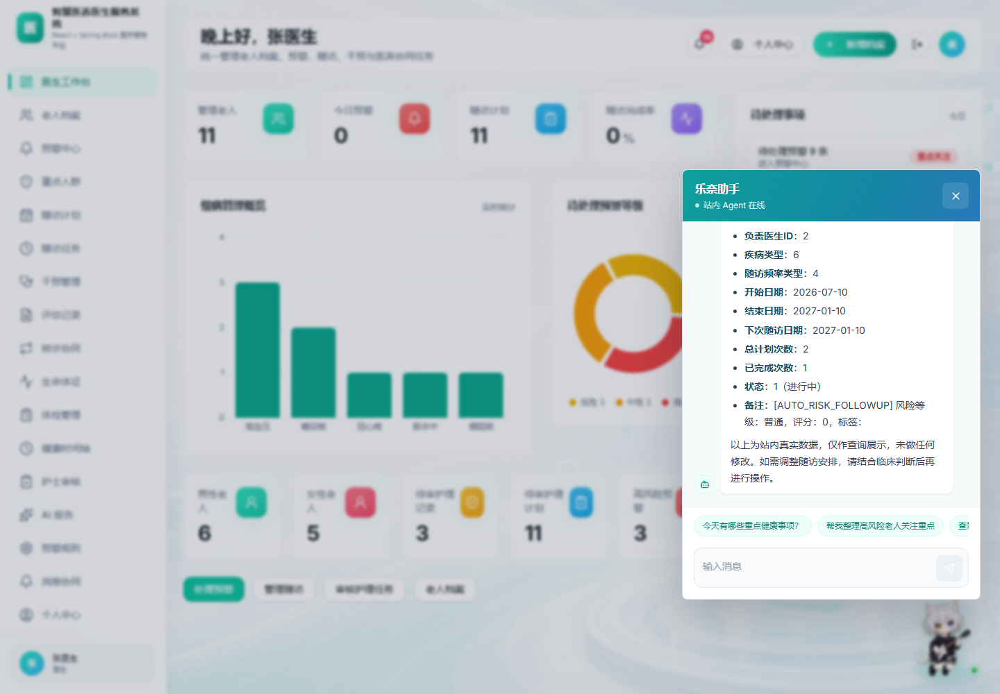
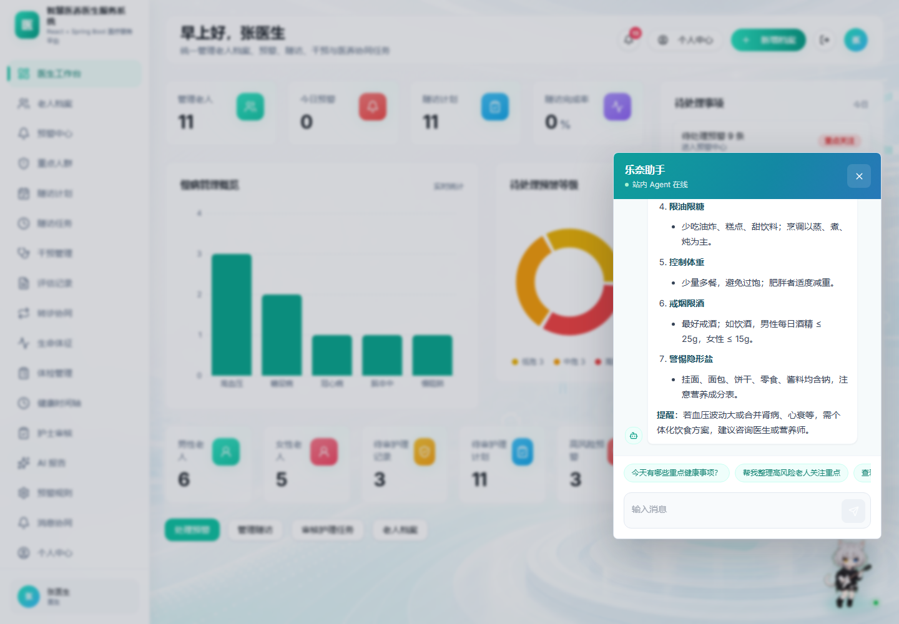
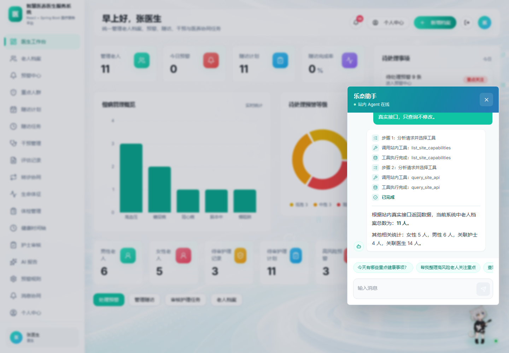
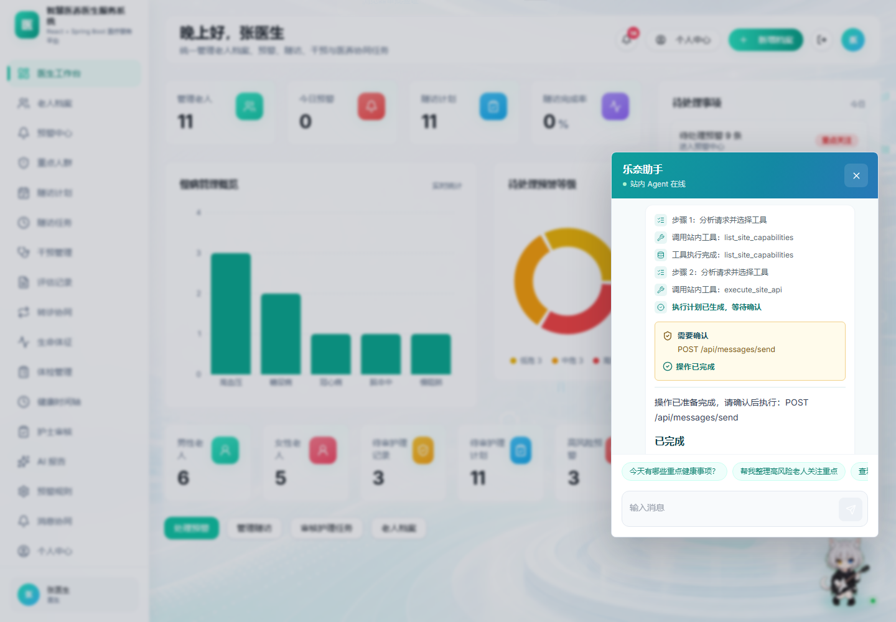
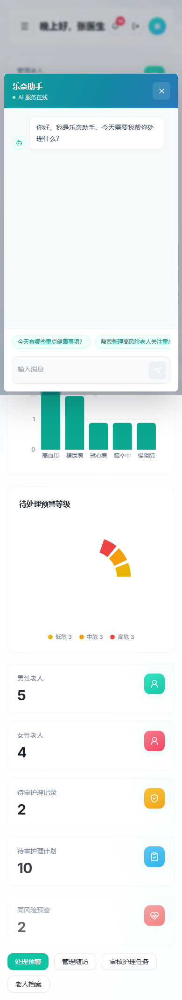

# Issue #119 验证记录

## 功能范围

1. 管理员用户治理、注册审核、封禁/解禁、重置密码、强制下线与全站操作审计。
2. 同一账号仅保留一个有效登录会话，新登录会使旧会话失效。
3. 乐奈助手同时支持普通问答与站内文本 Agent：普通问题直接流式回答，实时数据和站内操作才进入工具步骤与写操作确认。
4. AI 健康报告统一由 Kimi 生成，风险评分和风险等级仍由系统规则确定。
5. 管理员、医生、护士三端消息协同、未读提醒、已读状态与业务自动通知。
6. 按最新需求移除语音输入、语音播报和语音控制，仅保留文本交互。

## 自动化验证

- 后端：`mvnw test -DforkCount=0`，160 项测试全部通过。
- 前端：`npm run lint` 通过，仅保留两个既有 Fast Refresh 警告。
- 前端：`npm run build` 通过。
- 浏览器：管理员、医生、护士桌面端流程通过；管理员与 Agent 移动端布局无横向溢出。
- 登录：第二次登录后，第一次登录会话访问受保护接口返回 401。
- 管理员治理：创建、强制下线、封禁、解禁、重置密码与审计查询通过。
- Agent：真实随访数据查询通过；写操作先暂停等待确认，确认后执行并返回完成状态。
- 双模式：普通健康问答不下发工具、不显示 Agent 步骤；站内数据请求显示完整工具步骤。
- 权限：工具目录按管理员、医生、护士角色过滤，执行时再次校验角色和业务数据归属。
- 性能：服务器直连 Kimi 首包约 0.91 秒，站内数据查询实测约 6.1 秒。
- 消息：管理员到护士、护士到医生的消息发送、接收和标记已读通过。

## 数据保护

- 所有联调记录都使用唯一临时标记，并在验证后按主键精确删除。
- 核心业务表的记录数与校验值在测试前后保持一致。
- 未清空本地数据库，也未删除现有老人档案。

## 截图

### 管理员用户治理

### 操作审计

### 三端消息协同

### Agent 查询与 Markdown 渲染

### 普通问答模式

### Agent 双模式查询

### 写操作审批

### 写操作完成

### 移动端文本 Agent

