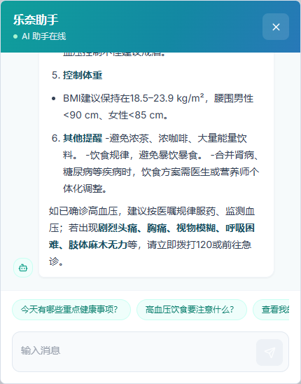
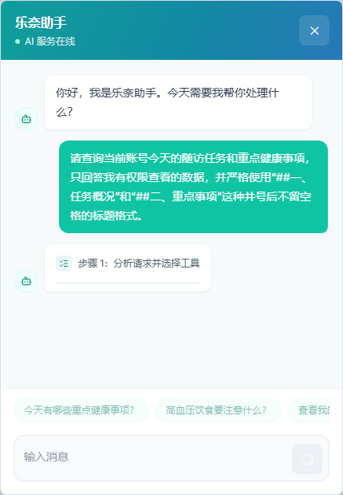
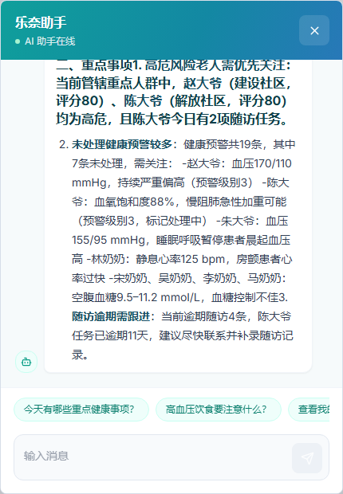
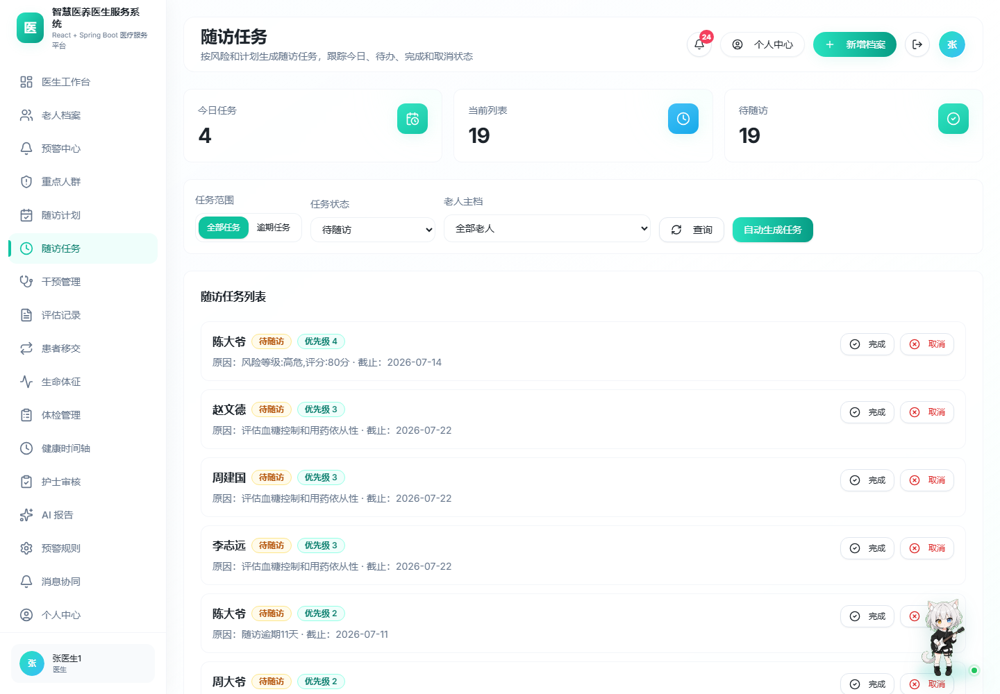
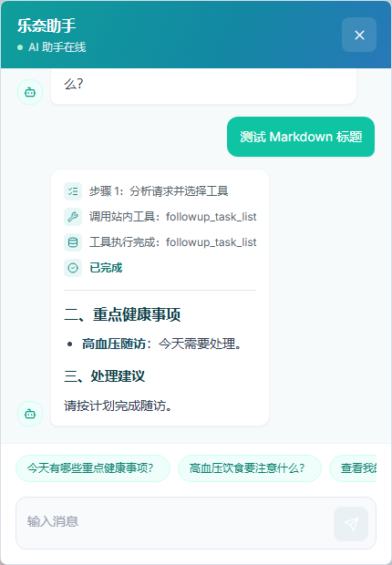
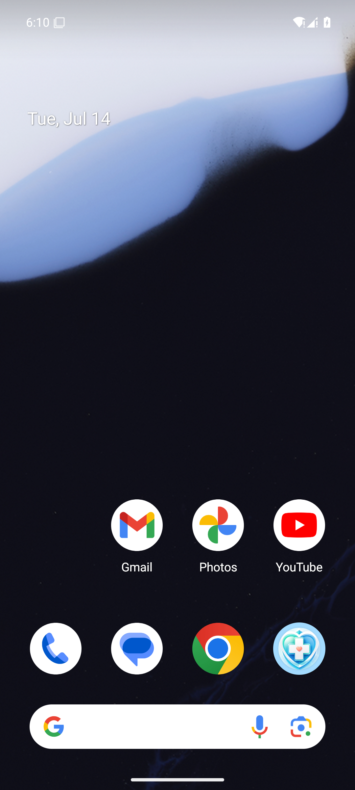
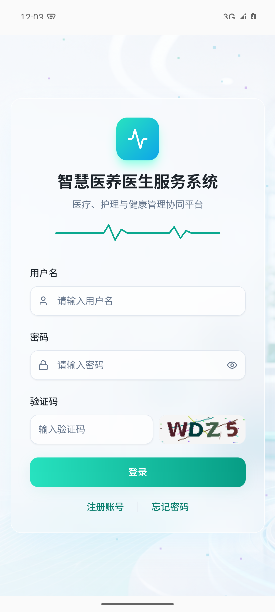
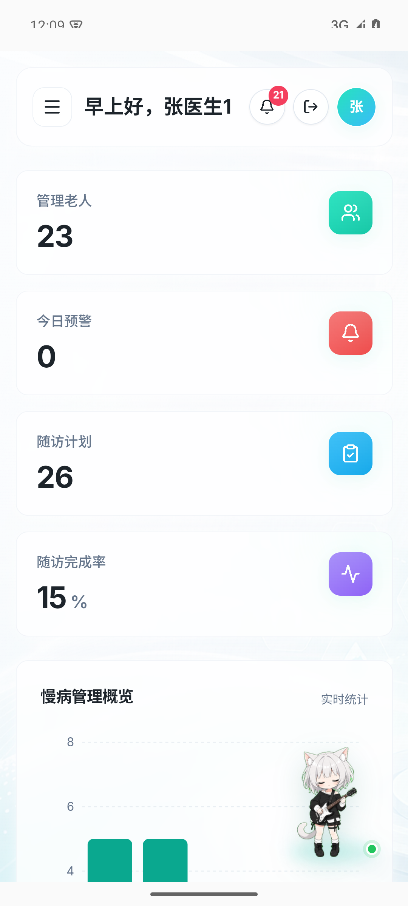
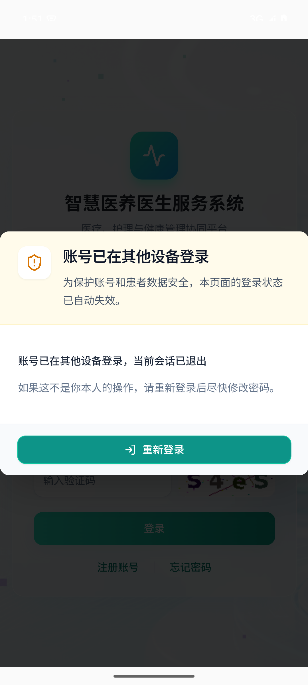

# 2026-07-15 verification evidence

## Streaming assistant

- Ordinary Q&A SSE: HTTP 200, 700 `delta` events, first delta at 2367 ms, last delta at 9205 ms.
- Site Agent SSE: `step -> tool -> tool_result -> delta -> done`, 144 `delta` events.
- Browser verification: Markdown rendered correctly and the assistant dialog had zero console errors.

### Production verification after deployment

- Public frontend returned HTTP 200 and served the merged `index-DUEmijKb.js` asset.
- Production Site Agent emitted `step -> tool -> tool_result -> delta -> done`.
- The verified request used 5 read-only site tools and received 5 tool results.
- The final answer contained 473 real `delta` events and 867 characters, with no SSE error event.
- Playwright observed 12 visible Agent progress steps, an 888-character answer and zero browser console errors.

## Data linkage and patient scope

- Full Maven suite: 210 tests, 0 failures, 0 errors, 0 skipped.
- Doctor task scope: doctor01 received 18 tasks and all `doctorId` values were 2.
- Another doctor task scope: doctor02 received 2 tasks and all `doctorId` values were 3.
- Care-team nurse scope: nurse02 received 20 tasks belonging to doctors 2 and 3.
- Administrator scope: 22 tasks belonging to doctors 2, 3 and 4.
- A doctor querying another doctor's task ID returned business code 403.
- Forged elder/health-record doctor ownership returned business code 403 even when workflow generation was disabled.
- Temporary full-flow elder generated risk profile, follow-up plan, follow-up task, structured AI report, health record, physical exam and timeline links.
- The temporary elder was visible to its doctor, the doctor's collaborating nurse and the administrator, but not to an unrelated doctor.
- Exact cleanup restored every audited domain-table count; the local database remained at 19 active elders.
- The legacy `POST /api/elders` endpoint now also generated risk, plan, task and AI report while preserving the original elder-ID response.

### Production role-scope verification

- `doctor01` could see 23 elders and 20 follow-up tasks.
- Every task elder was contained in the same doctor's visible elder set.
- Passing another doctor's `doctorId` to the task query returned business code 403.
- Production deployment preserved all existing data. The final protected deployment had no core-table count decrease; concurrent user activity added records and those additions were retained.

The machine-readable results are stored in [public-production-verification.json](./public-production-verification.json) and [production-ui-verification.json](./production-ui-verification.json).

## Markdown compatibility

- Compact headings such as `##二、重点健康事项` and `###三、处理建议` are normalized only outside fenced code blocks.
- Node regression tests: 2 passed, 0 failed.
- Local Playwright verified real `h2` and `h3` elements with no raw heading markers.
- Production Playwright verified at least one rendered heading and zero raw compact heading markers.

## Frontend and Android

- `npm run build`: passed.
- `npm run lint`: passed with two pre-existing Fast Refresh warnings and no errors.
- Android debug build: passed.
- Android release build: passed.
- Release APK signature: APK Signature Scheme v2 and v3 verified, RSA 2048-bit certificate.
- Final Release APK SHA-256: `7EDB6F186F1E1D694B471280756BE8916B3B4065760F1D14324ACACB63DF560E`.
- Android 15 emulator: install, launch, login, dashboard rendering, assistant dialog and native back-button close behavior passed.
- The release app loads `http://159.75.139.2`, so website and app use the same server and database.

